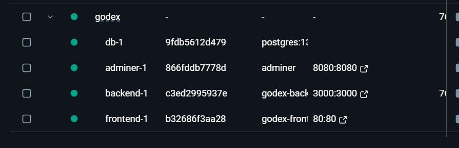
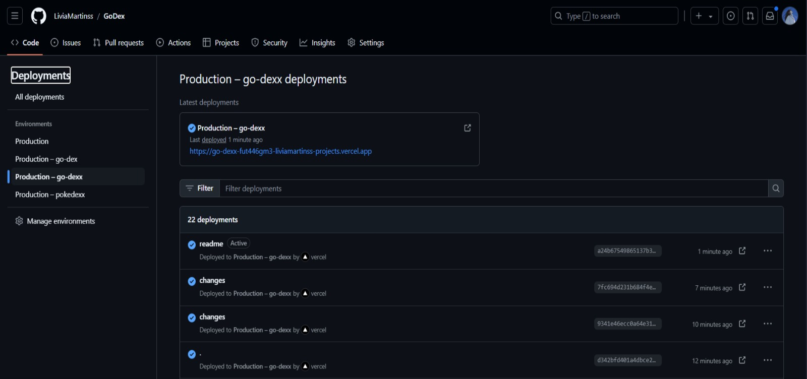
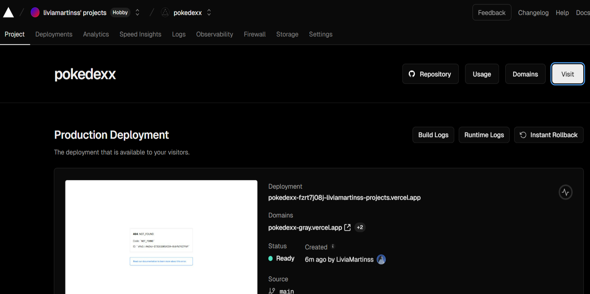
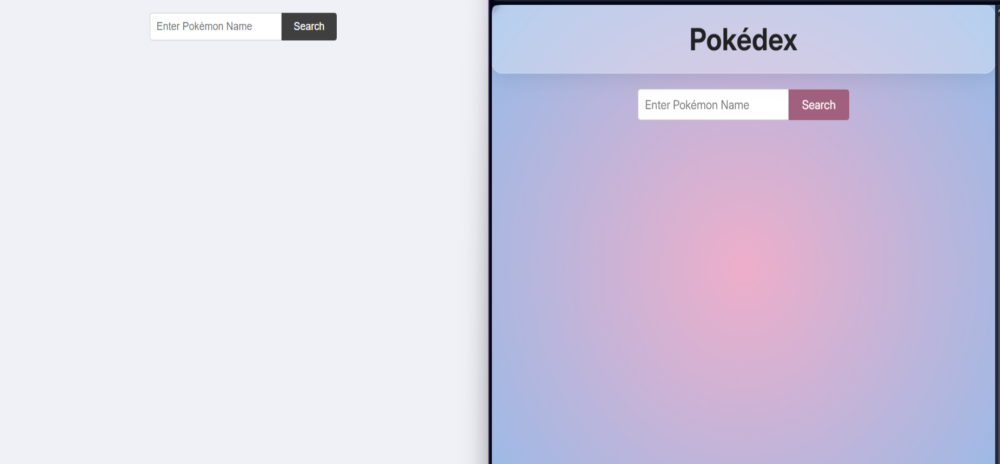
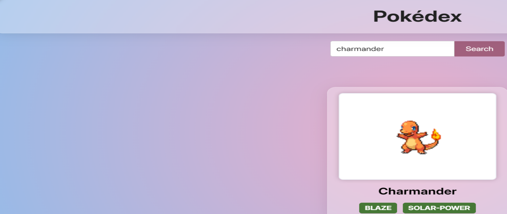

# ✨ Documentação - Pokédex

## 📋 Menu

- [Introdução](#introdução)
- [Instruções para Rodar o Projeto Localmente](#instruções-para-rodar-o-projeto-localmente)
  - [Pré-requisitos](#pré-requisitos)
  - [Passo a Passo](#passo-a-passo)
- [Como Funciona a Integração](#como-funciona-a-integração)
- [Documentação e Acesso](#documentação-e-acesso)
- [Como fiz o meu projeto](#como-fiz-o-meu-projeto)
  - [Clonagem e Configuração Inicial dos Repositórios](#1-clonagem-e-configuração-inicial-dos-repositórios)
  - [Configuração do Docker e Adição dos Arquivos Dockerfile](#2-configuração-do-docker-e-adição-dos-arquivos-dockerfile)
  - [Solução de Dependência do Backend para o Banco de Dados](#3-solução-de-dependência-do-backend-para-o-banco-de-dados)
  - [Tentativas com master.key e Variáveis de Ambiente](#4-tentativas-com-masterkey-e-variáveis-de-ambiente)
  - [Configuração do CI/CD com GitHub Actions e Deploy no Vercel](#5-configuração-do-cicd-com-github-actions-e-deploy-no-vercel)
  - [Otimizações e Melhorias no Código Backend](#6-otimizações-e-melhorias-no-código-backend)
  - [Integração Completa e Testes Locais](#7-integração-completa-e-testes-locais)
  - [Desafios no Deploy Final no Vercel e Render](#8-desafios-no-deploy-final-no-vercel-e-render)
  - [Estilização e Melhoria Visual](#9-estilização-e-melhoria-visual)
- [Conclusão](#Conclusão)

---

## Introdução

Esse projeto foi desenvolvido como parte de um desafio técnico. O objetivo era integrar uma aplicação backend em Ruby com uma aplicação frontend em React, ambos containerizados com Docker, com a adição de um banco de dados PostgreSQL e o gerenciamento desse banco de dados pelo Adminer. Além disso, foi solicitado o deploy da aplicação utilizando CI/CD com GitHub Workflows e Vercel. Documentei o desenvolvimento em etapas para compartilhar o processo, os desafios e as soluções implementadas :)

---

## Instruções para Rodar o Projeto Localmente

Para executar a aplicação em ambiente local usando Docker, siga as etapas abaixo:

### ✔️ Pré-requisitos

- Ter o Docker e o Docker Compose instalados em sua máquina.

### ✔️ Passo a Passo

1. No diretório onde está o `docker-compose.yml` (caso esteja em um repositório combinado ou em um diretório acima de `frontend` e `backend`), execute o seguinte comando:

   ```bash
   docker-compose up --build
   ```

   Esse comando irá:
   - 🏗️ Buildar as imagens Docker para o backend, frontend e o banco de dados.
   - 🚀 Iniciar os containers e integrar os serviços.

2. Acesse a aplicação:

   - O **frontend** estará disponível na porta http://localhost:5173
  
     
## Como Funciona a Integração

- O frontend se comunica com o backend para buscar informações sobre os Pokémon. Quando o usuário pesquisa um nome de Pokémon, o frontend faz uma requisição HTTP para o backend, que consulta o banco de dados e retorna os dados necessários.
- O banco de dados PostgreSQL é instanciado e configurado no Docker Compose para fornecer persistência ao backend.


## Como fiz o meu projeto?

### 1. Clonagem e Configuração Inicial dos Repositórios

Primeiramente, clonei os repositórios originais de Backend e Frontend, depois configurei para meu repositório local usando o comando:

```bash
git clone <URL do repositório>
```

Em seguida, alterei o repositório remoto para o meu próprio GitHub usando:

```bash
git remote set-url origin <URL do novo repositório>
```

### 2. Configuração do Docker e Adição dos Arquivos Dockerfile

Instalei o Docker Desktop e adicionei os arquivos `Dockerfile` tanto no backend quanto no frontend. Criei o arquivo `docker-compose.yml`, incluindo as configurações para o backend, frontend, PostgreSQL e o Adminer (ferramenta de gerenciamento de banco de dados). Com isso, consegui rodar os serviços individualmente e verificar a integração inicial dos containers.

### 3. Solução de Dependência do Backend para o Banco de Dados

O backend não estava iniciando corretamente porque aguardava a disponibilidade do banco de dados. Para resolver isso, modifiquei o script `entrypoint.sh`, adicionando uma checagem com `pg_isready` para garantir que o backend só inicie após o PostgreSQL estar disponível.

### 4. Tentativas com `master.key` e Variáveis de Ambiente

Adicionei o arquivo `master.key` e configurei variáveis de ambiente no `docker-compose.yml`. Isso incluiu a `RAILS_MASTER_KEY` e a `DATABASE_URL`. Porém, após enfrentar erros de conexão e inicialização, decidi explorar outras abordagens para a configuração do backend.

### 5. Configuração do CI/CD com GitHub Actions e Deploy no Vercel

Criei um workflow de CI/CD no GitHub, adicionando a pasta `.github/workflows` com o arquivo de configuração para deploy. Configurei o token do Vercel no GitHub e iniciei o processo de deploy automaticamente.


No entanto, ao tentar acessar o Vercel, me deparei com um erro 404. Após verificar a configuração, percebi que o projeto não estava sendo reconhecido automaticamente no Vercel e tive que adicionar manualmente.

### 6. Otimizações e Melhorias no Código Backend

Para otimizar e organizar o código backend, fiz algumas melhorias:
- Transformei os métodos `pokemon_name` e `pokemon_info` em métodos privados, pois não precisavam ser públicos.
- Utilizei memoização (`||=`) no método `show` para simplificar a chamada de `pokemon_info` e evitar dependência de variáveis de instância desnecessárias.

Essas mudanças tornam o código mais eficiente e claro, além de evitar chamadas redundantes à API. ;)

### 7. Integração Completa e Testes Locais

Após resolver vários desafios, consegui finalmente rodar a integração entre o backend e frontend com sucesso em ambiente local. Foi um momento de conquista, pois os serviços estavam todos funcionando no Docker, incluindo o banco de dados e o Adminer. Isso garantiu que a aplicação estava funcional e pronta para os próximos passos. (ufa)


### 8. Desafios no Deploy Final no Vercel e Render

A integração no Vercel continuou a apresentar problemas, especialmente o erro 404. Tentei investigar possíveis causas, como variáveis de ambiente e configurações específicas do backend, mas não consegui configurar o backend adequadamente no Render.



Apesar disso, localmente a aplicação funcionava perfeitamente, e decidi focar em documentar esse processo no README.

### 9. Estilização e Melhoria Visual

Amo deixar meus projetos a minha cara, então personalizei o design do frontend:
- Adicionei novos pokémons além do Pikachu, como Charmander, Bulbasaur, Squirtle e Jigglypuff.
- Criei uma estilização personalizada para a página, melhorando a experiência visual.

#### Antes e Depois da Estilização
Adicionei classes CSS para destacar o título e para tornar a página mais interativa e visualmente agradável.





> [!NOTE]
> Tive um problema com o print, por isso ficou com má qualidade a foto, porém a aplicação estava normal


---

### ✔️ Instruções para Rodar o Projeto Localmente

1. **Clone os Repositórios:**

   ```bash
   git clone <URL do repositório backend>
   git clone <URL do repositório frontend>
   ```

2. **Inicie os Containers:**

   No diretório principal, rode o comando:

   ```bash
   docker-compose up --build
   ```

3. **Acessando a Aplicação:**
   - Frontend: `http://localhost:80`


## Conclusão (Leia é importante!)

Amei a experiência de mergulhar em algo novo e trabalhar com ruby, queria expressar aqui que senti muito por não ter conseguido completar o desafio da maneira que queria, mas também procurei fazer além do que me pediram, essa não é a primeira vez que tento uma vaga com vocês, pois acredito muito nos valores da empresa e quero muito poder fazer parte desse time incrível! 

Se não for dessa vez podem ter certeza que tentarei novamente :) Estou disposta a estudar cada vez mais sobre ruby e seria uma grande alegria aprender mais com vocês, saibam que estou disposta a dar tudo de mim para crescer com a empresa e fazer parte desse time campeão ❤️